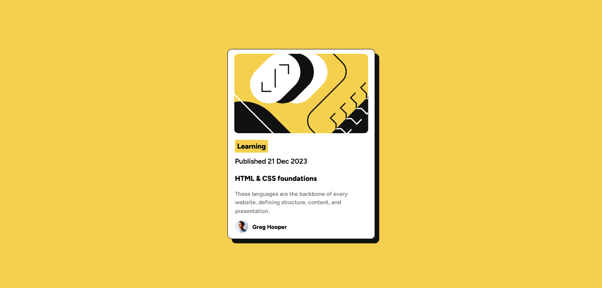

# Frontend Mentor - Blog preview card solution

This is a solution to the [Blog preview card challenge on Frontend Mentor](https://www.frontendmentor.io/challenges/blog-preview-card-ckPaj01IcS). Frontend Mentor challenges help you improve your coding skills by building realistic projects. 

## Table of contents

- [Overview](#overview)
  - [The challenge](#the-challenge)
  - [Screenshot](#screenshot)
  - [Links](#links)
- [My process](#my-process)
  - [Built with](#built-with)
  - [What I learned](#what-i-learned)
  - [Continued development](#continued-development)
  - [Useful resources](#useful-resources)
- [Author](#author)

**Note: Delete this note and update the table of contents based on what sections you keep.**

## Overview

### The challenge

Users should be able to:

- See hover and focus states for all interactive elements on the page

### Screenshot



### Links

- Solution URL: [blog-preview-card](https://github.com/saulgutierrez/blog-preview-card-main)
- Live Site URL: [blog-preview-card](https://zingy-dango-8557c6.netlify.app/)

## My process

### Built with

- Semantic HTML5 markup
- CSS custom properties
- Flexbox

### What I learned

:nth-child() CSS pseudo-class:
```css
li:nth-child(1) {
    margin: 15px 0px 10px 0px;
    font-weight: 800;
    ...
}
```

### Continued development

Use of CSS variables and JavaScript code.

### Useful resources

- [social-links-profile](https://github.com/saulgutierrez/social-links-profile-main) - This project help me to remember some basic concepts of CSS Flexbox.
- [mdn web docs](https://developer.mozilla.org/en-US/docs/Web/CSS) - Documentation site and guides for HTML, CSS and JS.

## Author

- Website - [Saúl Gutiérrez](https://sauladai.netlify.app/)
- Frontend Mentor - [@saulgutierrez](https://www.frontendmentor.io/profile/saulgutierrez)

